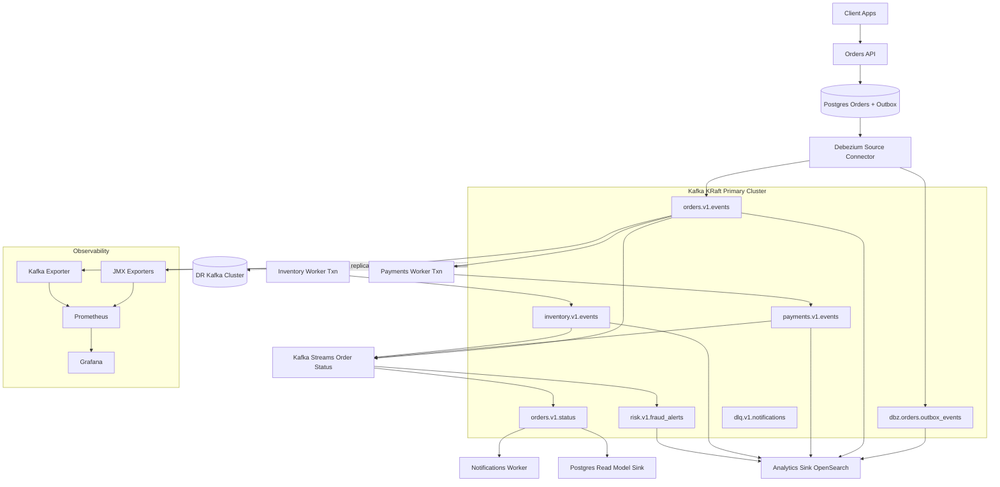
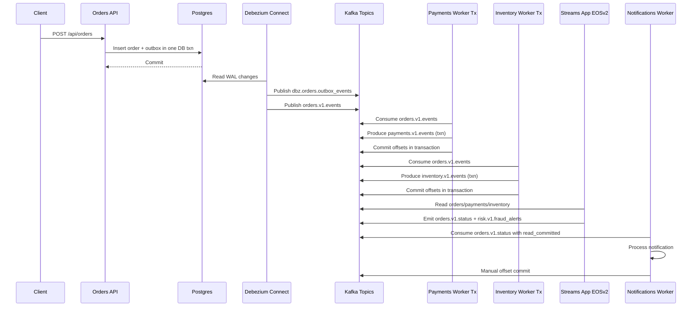
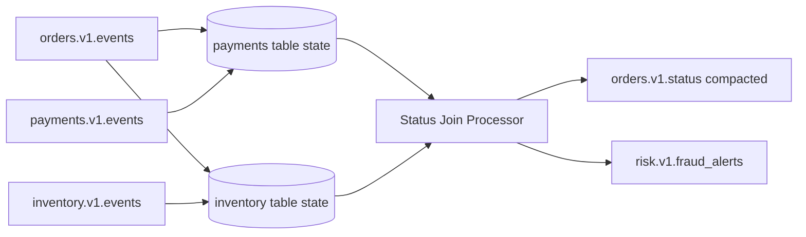

# Kafka Event-Driven Commerce Platform

Enterprise-grade event-driven microservices platform built on Kafka in KRaft mode, with CDC ingestion, schema governance, transactional stream processing, operational observability, and disaster-recovery replication.

## Executive Summary

This repository demonstrates a production-minded architecture for order lifecycle orchestration:

- API + Outbox pattern for write safety and event publication integrity
- Debezium CDC on Kafka Connect in distributed mode
- Schema Registry-backed Avro contracts with backward-compatible evolution
- Transactional consumers/producers for high-value domains (payment and inventory)
- Kafka Streams stateful joins with `exactly_once_v2`
- ksqlDB for real-time analytical materializations
- Prometheus/Grafana + lag monitoring for operations
- Security progression from TLS to SASL/SCRAM + ACL authorization
- MirrorMaker2 for multi-cluster DR readiness

## Business Capabilities

- Order intake and event publication
- Payment authorization workflow
- Inventory reservation workflow
- Real-time consolidated order status
- Fraud/risk event stream
- Notification dispatch pipeline
- Analytics and read-model sinks

## Non-Functional Requirements (Target)

- Availability: highly available broker metadata and topic replication in RF=3 primary cluster
- Durability: explicit topic provisioning and critical internal topics with replication and compaction controls
- Consistency: transactional semantics for high-value consume-process-produce pipelines
- Recoverability: DR topic and consumer offset replication through MirrorMaker2
- Operability: standardized runbook and dashboard-first troubleshooting
- Security: staged rollout from encryption-only to authentication + authorization

## High-Level Design (HLD)



## Low-Level Design (LLD)

### LLD-1: Order Lifecycle Sequence



### LLD-2: Topic and State Topology



## Repository Structure

```text
infra/
  compose/
  k8s/
schemas/
services/
  orders-api/
  payments-worker/
  inventory-worker/
  streams-order-status/
  notifications-worker/
connectors/
ksqldb/
docs/
Makefile
```

## Component Responsibilities

| Component | Responsibility | Reliability Profile |
|---|---|---|
| Orders API | Persist order and outbox atomically | DB transaction integrity |
| Debezium Connector | CDC from outbox to Kafka | Distributed Connect + durable internal topics |
| Payments Worker | Authorize payments | Transactional producer + idempotence |
| Inventory Worker | Reserve stock | Transactional producer + idempotence |
| Streams App | Join latest state and derive status | Kafka Streams EOS v2 |
| Notifications Worker | Downstream side effects | Manual commit + read_committed |
| JDBC Sink | Serve read model | Upsert sink with DLQ/error context |
| Analytics Sink | Event indexing for reporting | Error-tolerant sink with DLQ |

## Topic Governance

All domain topics use Avro + Schema Registry with subject naming `<topic>-value` and global compatibility `BACKWARD`.

| Topic | Partitions | RF | Cleanup | Key |
|---|---:|---:|---|---|
| orders.v1.events | 6 | 3 | delete | order_id |
| payments.v1.events | 6 | 3 | delete | order_id |
| inventory.v1.events | 6 | 3 | delete | order_id |
| orders.v1.status | 6 | 3 | compact | order_id |
| risk.v1.fraud_alerts | 3 | 3 | delete | order_id |
| web.v1.clickstream | 6 | 3 | delete | customer_id |
| analytics.v1.product_metrics | 6 | 3 | delete | product_id |
| analytics.v1.web_path_metrics | 6 | 3 | delete | path |
| dbz.orders.outbox_events | 6 | 3 | delete | aggregate_id |
| retry.v1.notifications.5s | 3 | 3 | delete | passthrough |
| retry.v1.notifications.1m | 3 | 3 | delete | passthrough |
| dlq.v1.notifications | 3 | 3 | delete | passthrough |

## Implementation Code Pointers

- Transactional producers:
  - `services/payments-worker/src/main/java/com/example/payments/PaymentsWorkerApplication.java`
  - `services/inventory-worker/src/main/java/com/example/inventory/InventoryWorkerApplication.java`
- Transaction-aware consumer (`read_committed`) with manual commits and retry tiers:
  - `services/notifications-worker/app.py`
- Streams EOS v2 and stateful joins:
  - `services/streams-order-status/src/main/java/com/example/streams/OrderStatusStreamsApplication.java`
- Connect distributed mode + CDC SMT chain:
  - `infra/compose/docker-compose.yml`
  - `connectors/debezium-orders-outbox.json`
  - `connectors/debezium-orders-outbox-raw.json`
  - optional data-lake sink template: `connectors/sink-raw-events-datalake.template.json`
- Topic provisioning with RF/partitions/compaction/retention:
  - `infra/compose/scripts/create-topics.sh`

## Security Architecture

| Stage | Scope | Activation |
|---|---|---|
| Stage A | TLS encryption in transit | `make up-tls` |
| Stage B | SASL/SCRAM + TLS + ACL | `make up-sasl`, `make scram-users`, `make acls` |

KRaft authorization target uses `StandardAuthorizer` for ACL enforcement.

## Observability Architecture

- Broker metrics via JMX exporter sidecars
- Consumer/group lag and topic metrics via kafka-exporter
- Central scrape via Prometheus
- Dashboard provisioning via Grafana (datasource + platform dashboard JSON)
- Topic/consumer/connect inspection via Kafka UI (`http://localhost:8085`)
- Runbook-driven incident response for lag and ISR events

## Disaster Recovery and Resilience

- Secondary DR Kafka cluster available through compose profile
- MirrorMaker2 replication for topic data and group offsets
- Checkpoint and offset sync configuration included
- DR drill flow documented in demo runbook

## Build and Runtime Commands

### Local secret setup

1. Copy `infra/compose/.env.example` to `infra/compose/.env.local`
2. Replace all `CHANGE_ME_*` values with strong credentials
3. Keep `infra/compose/.env.local` uncommitted (gitignored)

### Platform bootstrap

1. `make up`
2. `make topics`
3. `make schemas-compat`
4. `make schemas`
5. `make connectors`
6. `make ksqldb`

### Service runtime

- `make run-orders-api`
- `make run-payments`
- `make run-inventory`
- `make run-streams`
- `make run-notifications`
- `make run-telemetry`

### Validation and operations

- `make validate`
- `make lag`
- `make dr-up`
- `make up-separated`

## Public Repository Security Guardrails

- No real credentials are stored in tracked connector JSON or service config files
- Runtime secrets are injected from local env files by scripts in `infra/compose/scripts/`
- Security reporting policy is defined in `SECURITY.md`
- Automated scans enabled via GitHub workflows:
  - `.github/workflows/codeql.yml`
  - `.github/workflows/secret-scan.yml`
  - `.github/workflows/dependency-review.yml`
- Dependency update automation enabled through `.github/dependabot.yml`

## Enterprise Readiness Checklist

- Explicit topic provisioning and policy controls
- CDC + outbox pattern to avoid dual-write hazards
- Schema compatibility policy and evolution workflow
- High-value transactional processing for critical events
- Stateful stream processing with exactly-once guarantees
- Error-tolerant sinks and DLQ routing
- Observability stack with lag and broker internals
- Security posture progression (TLS -> SCRAM/ACL)
- DR replication topology and failover drills

## Documentation Index

- `docs/architecture.md`
- `docs/decisions.md`
- `docs/configuration.md`
- `docs/topic-contracts.md`
- `docs/delivery-semantics.md`
- `docs/schema-evolution-demo.md`
- `docs/runbook.md`
- `docs/demo.md`
- `docs/checklist-completion.md`
- `docs/validation-report.md`
